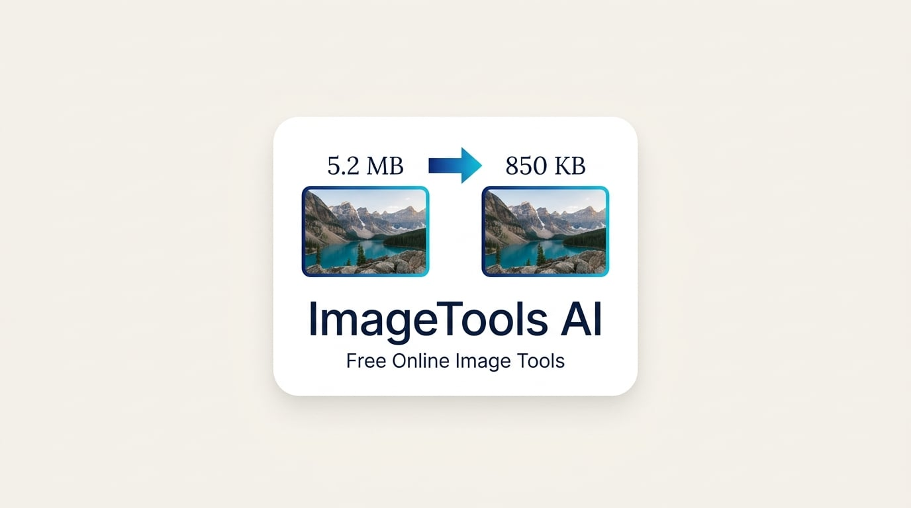

# ImageTools AI

<p align="center">
  
</p>

<p align="center">
  <a href="https://imagetools-ai.vercel.app/" target="_blank" rel="noopener noreferrer">Live Demo</a>
  ·
  <a href="https://github.com/jutthamid148-svg/imagetools-ai" target="_blank" rel="noopener noreferrer">GitHub Repo</a>
</p>

<p align="center">
  <strong>Free online image tools for converting, compressing, resizing, cropping, and editing photos directly in your browser.</strong>
</p>

<p align="center">
  
</p>

## Overview

ImageTools AI is a modern web application designed to help users process images quickly and privately without needing to install software or create an account. Most tools run directly in the browser using the Canvas API, making the workflow fast, secure, and easy to use on desktop and mobile devices.

## Why This Project

- Browser-based image processing for privacy and speed
- No signup required for standard tools
- Supports common image tasks in one place
- Works well for personal, business, and content workflows
- Includes optional AI-powered features for metadata and descriptions

## Core Features

- JPG, PNG, WebP, BMP, and TIFF conversions
- Image compression with quality controls
- Resize and crop tools
- Rotate, flip, grayscale, blur, sharpen, and enhancement tools
- PDF generation from images
- Image metadata cleaning and dimension checking
- Optional AI tools for alt text, SEO metadata, and analysis

## Tool Categories

- Convert images
- Compress images
- Resize and crop
- Edit and enhance
- Convert to PDF
- AI-powered content tools

## Screenshots

### App Preview


### Brand Logo


## Tech Stack

- Vite
- JavaScript
- HTML / CSS
- Canvas API
- pdf-lib
- utif
- Optional Gemini AI API integration

## Project Structure

```text
imagetools-ai/
├── ai/
│   └── ai-service.js
├── api/
│   └── ai.js
├── assets/
│   ├── icons/
│   └── images/
├── css/
├── js/
├── public/
├── scripts/
├── tools/
├── .gitignore
├── 404.html
├── about.html
├── ai-tools.html
├── compress.html
├── contact.html
├── convert.html
├── edit.html
├── index.html
├── manifest.json
├── package.json
├── privacy.html
├── resize.html
├── robots.txt
├── script.js
├── sitemap.xml
├── style.css
├── sw.js
├── terms.html
├── tools.html
├── vercel.json
├── vite.config.js
├── whop.app.json
├── worker.js
├── wrangler.json
├── README.md
└── package-lock.json
```

## Getting Started

### 1. Install dependencies

```bash
npm install
```

### 2. Run the project locally

```bash
npm run dev
```

### 3. Build for production

```bash
npm run build
```

### 4. Preview production build

```bash
npm run preview
```

## AI Features

Some AI-driven tools use a server-side endpoint that requires a Gemini API key.

```bash
GEMINI_API_KEY=your_api_key_here
```

If the key is missing or invalid, AI tools will return an unavailable message and the local image tools will continue to work normally.

## Deployment

The project includes deployment configuration for Vite and related hosting workflows.

```bash
npm run deploy
```

## Notes

- Most operations are processed locally in the browser.
- AI features are optional and separate from the core tools.
- Best suited for private, quick, and repeatable image editing tasks.

## License

This project is provided for educational and local project use. If you plan to publish or commercialize it, review and update the licensing terms before release.

## Contact

For questions, updates, or feature requests, connect with the project maintainer through the repository or project contact information.

